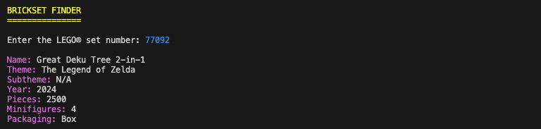
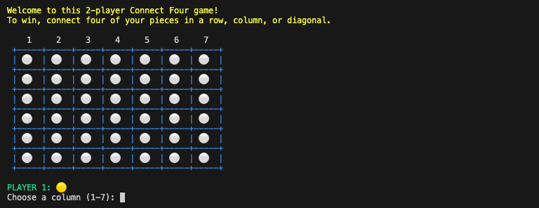
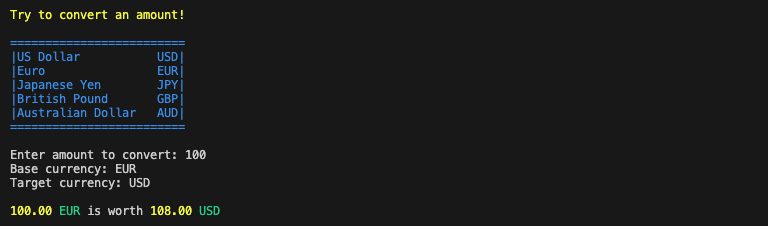
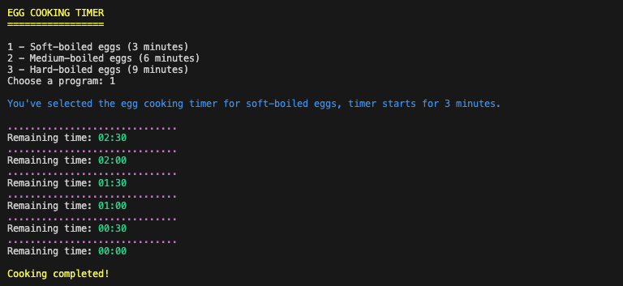
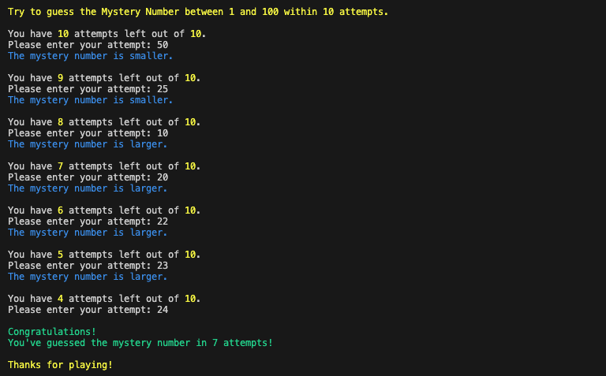
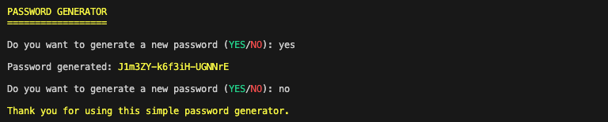
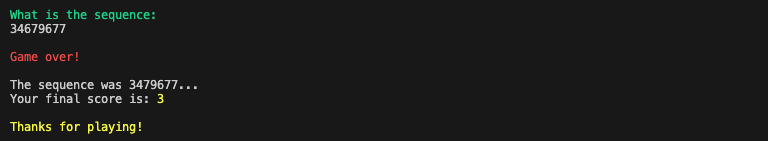
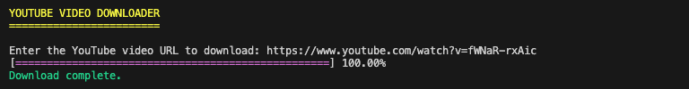

# Training Exercices

## Description

This repository contains a collection of Python scripts created as part of my training and experimentation with the language. Each script represents a practical exercise aimed at improving my programming skills, testing concepts, or exploring the functionality of specific libraries. It serves as a hands-on approach to learning, providing a space to apply theoretical knowledge and develop real-world solutions.

## Objectives

- Document my learning journey with Python.
- Practice writing clean, functional, and maintainable code.
- Explore and experiment with various Python libraries and features.
- Apply theoretical knowledge through hands-on exercises.
- Build a solid foundation for tackling more advanced projects in the future.

## Tech Stack


## File Description

| **FILE**                      | **DESCRIPTION**                                                       |
| :---------------------------: | --------------------------------------------------------------------- |
| `assets`                      | Contains the resources required for the repository.                   |
| `brickset_finder.py`          | Python script to search for a LEGO® set using the Brickset API.       |
| `connect_four.py`             | Python script for a two players Connect Four Game.                    |
| `currency_converter.py`       | Python script for currency conversion using an API.                   |
| `egg_cooking_timer.py`        | Python script for a simple egg cooking timer.                         |
| `mental_arithmetic.py`        | Python script for a mental arithmetic quiz game.                      |
| `mystery_number.py`           | Python script for a number guessing game.                             |
| `password_generator.py`       | Python script for a secure password generator.                        |
| `simon.py`                    | Python script for a digital version of the Simon game, using numbers. |
| `youtube_video_downloader.py` | Python script to download a YouTube video from its url.               |
| `requirements.txt`            | List of dependencies required for the script.                         |
| `.gitignore`                  | Specifies files and folders to be ignored by Git.                     |
| `README.md`                   | The README file you are currently reading 😉.                         |

## Installation & Usage

### Installation

1. Clone this repository:
    - Open your preferred Terminal.
    - Navigate to the directory where you want to clone the repository.
    - Run the following command:

```
git clone https://github.com/fchavonet/python-training_exercises.git
```

2. Open the cloned repository.

3. Create a virtual environment:

```
python3 -m venv venv
```

4. Activate the virtual environment:

```
source venv/bin/activate
```

> On Windows: `venv\Scripts\activate`.

5. Install dependencies:

```
pip install -r requirements.txt
```

### Usage

1. Run one of these commands:

```
./brickset_finder.py
```

For the `brickset_finder.py` script, you need to create a `config.json` file at the root of the project directory with the following content:

```
{
    "api_key": "<api key number>"
}
```

You can request an API key from this page: [Brickset API key request](https://brickset.com/tools/webservices/requestkey).

<p align="center">
    
</p>

---

```
./connect_four.py
```

<p align="center">
    
</p>

---

```
./currency_converter.py
```

<p align="center">
    
</p>

---

```
./egg_cooking_timer.py
```

<p align="center">
    
</p>

---

```
./mental_arithmetic.py
```

<p align="center">
    
</p>

---

```
./mystery_number.py
```

<p align="center">
    
</p>

---

```
./password_generator.py
```

<p align="center">
    
</p>

---

```
./simon.py
```

<p align="center">
    
</p>

---

```
./youtube_video_downloader.py
```

<p align="center">
    
</p>

---

## What's Next?

- Doing more exercises!

## Thanks

- A big thank you to my friends Pierre and Yoann, always available to test and provide feedback on my projects.

## Author(s)

**Fabien CHAVONET**
- GitHub: [@fchavonet](https://github.com/fchavonet)
